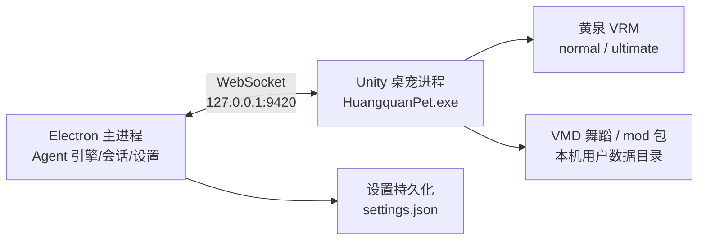

# Electron ↔ Unity 桥接架构（黄泉桌宠 0.4.0）

## 拓扑



- Electron 起本地 WS 服务（`ws` 库，仅监听 `127.0.0.1`，随机可用端口，握手校验 token）。
- Unity 侧新增 `HqBridgeClient` MonoBehaviour：`-connect ws://127.0.0.1:<port>?token=...` 启动参数接入，断线自动重连。
- 桌宠进程由 `electron/pet.ts` 的 PetManager 派生/守护：崩溃重启、退出清理、心跳（2s 无 pong 判死）。

## 消息协议（JSON，一行一条）

```jsonc
// Electron → Unity
{ "type": "config", "payload": { "form": "normal|ultimate", "scale": 1.0, "opacity": 0.9,
  "anchor": "float|window|taskbar", "topmost": true, "fps": 60, "chibi": 1.0,
  "physics": true, "breath": "normal", "vrmDir": "D:/.../pet/models/vrm" } }
{ "type": "action", "payload": { "action": "idle|dance1|dance2|dance3|feed|poke|sleep" } }
{ "type": "chat", "payload": { "text": "...", "streaming": true, "delta": "..." } }
{ "type": "state", "payload": { "state": "working|done|error", "text": "..." } }

// Unity → Electron
{ "type": "event", "payload": { "event": "dragging|dragend|poke|eat|click|ready", "x": 0, "y": 0 } }
{ "type": "chat-input", "payload": { "text": "..." } }
{ "type": "pong", "payload": { "t": 123 } }
```

## 能力分工

| 关注点 | 归属 |
| --- | --- |
| 窗口透明/置顶/形状（点击穿透） | Unity 内 Win32（DwmApi/SetWindowLong），Mate-Engine 已有 |
| 拖拽、坐视窗/任务栏、任务栏探测 | Unity 内实现；坐标回传 Electron 持久化 |
| 聊天流、口型/表情驱动、气泡 | Electron 推流 → Unity Animator/Blendshape |
| 会话/记忆/工具/定时任务 | Electron 引擎，桌宠只做展示与触发 |
| 音频捕获（WASAPI）与节拍 | Unity 内 NAudio/原生；节拍事件回传 Electron 记日志 |
| 模型/动作/配饰素材 | 本机用户数据目录，不进仓库 |

## 升级路径（旧桌宠）

- `settings.general.pet.engine`：`web`（旧 three.js）→ `unity`（新）。默认改 `unity`。
- 旧 `pet/` 目录保留归档；`PetManager` 增加 Unity 分支，IPC 接口（toggle/form/action/anchor/options）语义不变，
  上层 UI 无需改动。

## 安全

- WS 只绑 `127.0.0.1`，每次启动生成随机 token；无 token 握手一律断开。
- Unity 桌宠不加载远程内容；mod 只允许白名单资产类型（动画/音频/粒子/配饰），无脚本执行。
